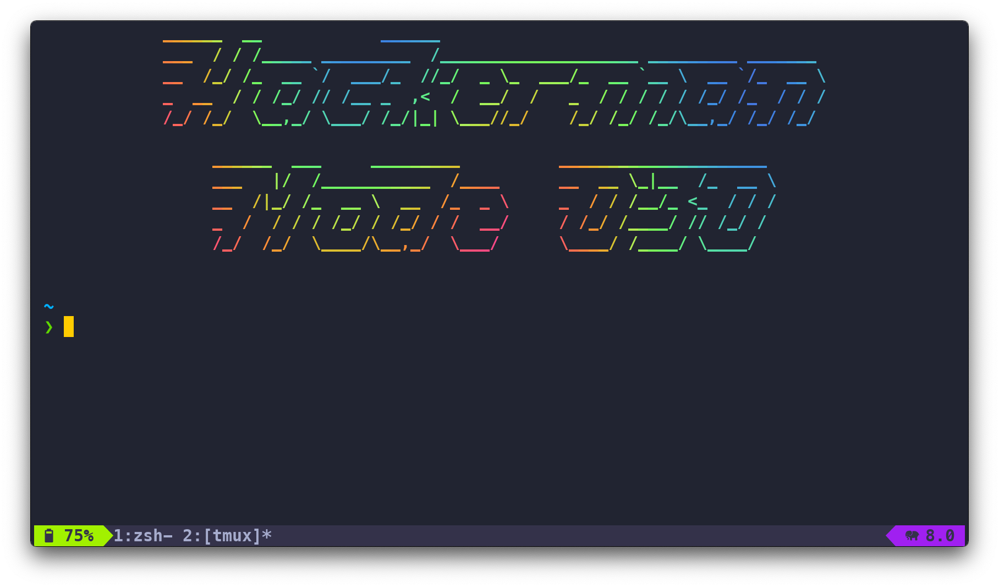

# 🖥️ WezTerm Configuration

<div align="center">
  
</div>

## 📖 Overview

My primary terminal emulator configuration, fully written in **Lua**. WezTerm offers GPU acceleration, comprehensive ligature support, and a highly hackable configuration system that fits perfectly with my Lua-centric dotfiles philosophy.

## ✨ Features

- **🚀 GPU Accelerated**: Blazing fast rendering using Metal (on macOS).
- **🎨 Custom Themes**: Includes my custom `jassie030` and accessibility-focused `jassiea11y` schemes.
- **⌨️ Modal Multiplexing**: Tmux-like keybindings without the overhead of Tmux.
- **🔤 Font Fallbacks**: Robust font stack including Cascadia Code, Nerd Fonts, and PragmataPro.
- **🔄 Dynamic Config**: Hot-reloading of configuration and automatic dark/light mode switching.

## 📂 File Structure

The configuration is split into modules for maintainability:

```text
config/wezterm/
├── wezterm.lua         # Entry point
├── keymap.lua          # Keybindings & leader config
├── handlers.lua        # Event handlers (resize, theme switch)
├── fonts.lua           # Font configuration & scaling logic
├── theme.lua           # Theme loading & logic
└── colors/             # Custom color schemes
    ├── jassie030.lua
    └── jassiea11y.lua
```

## ⌨️ Keybindings

The **Leader Key** is set to `Ctrl` + `d`.

| Keys | Action |
| :--- | :--- |
| **Cmd** + `c` | Copy to Clipboard |
| **Cmd** + `v` | Paste from Clipboard |
| **Leader** + `s` | Split Vertical |
| **Leader** + `v` | Split Horizontal |
| **Leader** + `z` | Toggle Zoom Pane |
| **Leader** + `x` | Close Pane |
| **Leader** + `c` | New Tab |
| **Leader** + `1-9` | Switch to Tab 1-9 |
| **Alt** + `Arrow` | Navigate Panes (Vim-aware) |
| **Cmd** + `+`/`-` | Increase/Decrease Font Size |

## 🎨 Themes

I maintain two custom themes in the `colors/` directory:

- **jassie030**: My original deeply saturated blue/purple theme.
- **jassiea11y**: An accessible, higher contrast variation (Light & Dark modes).

> **Note**: The config automatically detects the system appearance (Dark/Light) and switches the theme variant accordingly via `handlers.lua`.
